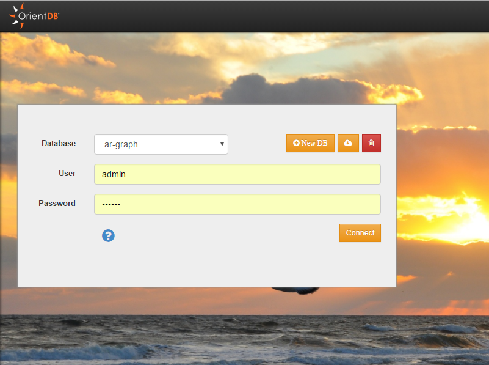
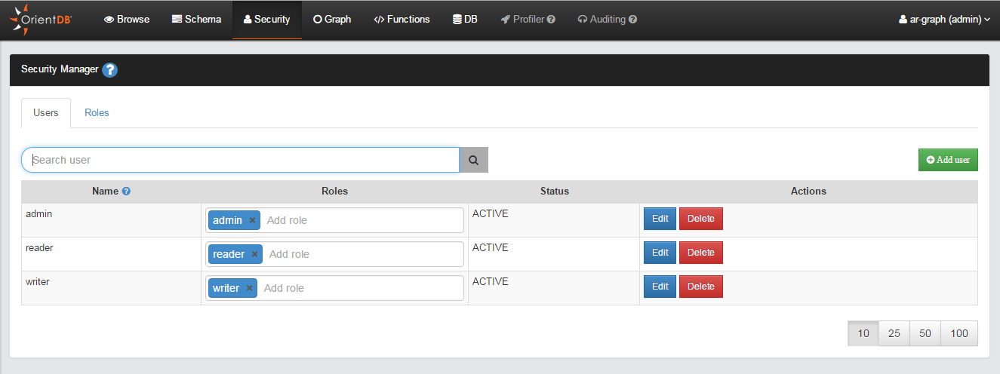
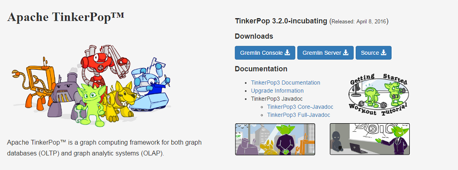

## OrientDB Research

Here you will find the notes and configuration to support my investigation of OrientDB.

### Research Guidelines

* Real time catalog
* Event driven data
* Temporal information
* Synchronization

### Docker Container

I am using an OrientDB image for Docker.

```bash
$ docker pull orientdb/orientdb
```

In order to persist and share my OrientDB configuration and data, I have added a Docker data volume. In the spirit of ease-of-use (and laziness) I have captured the set up in a `docker-compose` configuration file.

```yaml
# docker-compose up -d

orientdb:
  container_name: orientdb
  image: orientdb/orientdb
  ports:
    - "2424:2424"
    - "2480:2480"
  volumes:
    - ./data/orientdb/config:/orientdb/config
    - ./data/orientdb/databases:/orientdb/databases
  environment:
     ORIENTDB_ROOT_PASSWORD: n0v3ll
```

### Getting Started

You should now be able to access OrientDB Studio on the server. On Windows, the URL is http://192.168.99.100:2480/. Whereas on Mac OS X or Linux, it is http://localhost:2480/. Upon entering the link into your browser, you are met with a login screen.



Once you have logged in you may view the schema.

#### Security Manager



See also http://wiki.esecurity.net:8090/display/ARCH/Deploy+OrientDB+to+Docker+Container.

### Querying OrientDB

* Binary
* REST
* SQL
* Gremlin

Gremlin (TinkerPop) - Graph traversal language



### Support for GraphQL

Support for GraphQL? #4978
* Open    `smolinari` opened this issue on Sep 17, 2015 · 13 comments
https://github.com/orientechnologies/orientdb/issues/4978

Feature plans? #72
* Open    `seeden` opened this issue on Aug 21, 2015 · 16 comments
https://github.com/orientechnologies/orientjs/issues/72

**Note**: ArangoDB *does* support GraphQL, based on issue ##1468; see https://github.com/arangodb/arangodb/issues/1468#issue-104571974.

#### OrientDB vs ArangoDB

* https://www.arangodb.com/community/
* https://orientdbleaks.blogspot.com/2015/06/the-orientdb-issues-that-made-us-give-up.html
